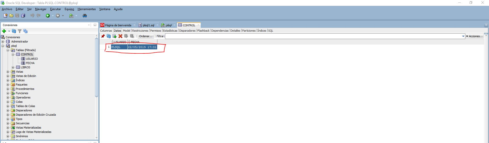

# Relacion 4 de ejercicio de PL/SQL Disparadores

## Tablas

```sql
DROP TABLE CONTROL;
DROP TABLE libros;

CREATE TABLE libros(
  codigo NUMBER(6),
  titulo VARCHAR2(40),
  autor VARCHAR2(30),
  editorial VARCHAR2(20),
  precio NUMBER(6,2)
 );

 CREATE TABLE control(
  usuario VARCHAR2(30),
  fecha DATE
 );

INSERT INTO libros VALUES(100,'Uno','Richard Bach','Planeta',25);
 INSERT INTO libros VALUES(103,'El aleph','Borges','Emece',28);
 INSERT INTO libros VALUES(105,'Matematica estas ahi','Paenza','Nuevo siglo',12);
 INSERT INTO libros VALUES(120,'Aprenda PHP','Molina Mario','Nuevo siglo',55);
 INSERT INTO libros VALUES(145,'Alicia en el pais de las maravillas','Carroll','Planeta',35);

--Establecemos el formato de fecha para que muestre "DD/MM/YYYY HH24:MI":

 alter SESSION SET NLS_DATE_FORMAT = 'DD/MM/YYYY HH24:MI';
```
## Ejercicio

- Una librería almacena los datos de sus libros en una tabla denominada "libros" y controla las acciones que los empleados realizan sobre dicha tabla almacenando en la tabla "control" el nombre del usuario y la fecha, cada vez que se modifica el "precio" de un libro.

- Creamos un disparador a nivel de fila que se dispare cada vez que se actualiza el campo "precio"; el trigger debe ingresar en la tabla "control", el nombre del usuario, la fecha y la hora en la cual se realizó un "update" sobre "precio" de "libros".

```sql
CREATE OR REPLACE TRIGGER trigger_libros
    BEFORE UPDATE OF PRECIO
         ON libros
    FOR EACH ROW
BEGIN
  INSERT INTO control VALUES (USER, TO_CHAR(SYSTIMESTAMP,'DD-MM-YYYY HH24:MI:SS'));
END trigger_libros;
```

- Update para comprobar que funciona el disparador

```sql
UPDATE LIBROS
SET PRECIOS=30
WHERE TITULO LIKE 'Uno'
```

- Resultado:



> La sentencia PL/SQL empieza con el declare del disparador para que antes de que se actualice precio de la tabla libros realize una inserción en la tabla control, con las información del usuario que ha realizado la modificación y la fecha y la hora a la que se realizó la actualización.