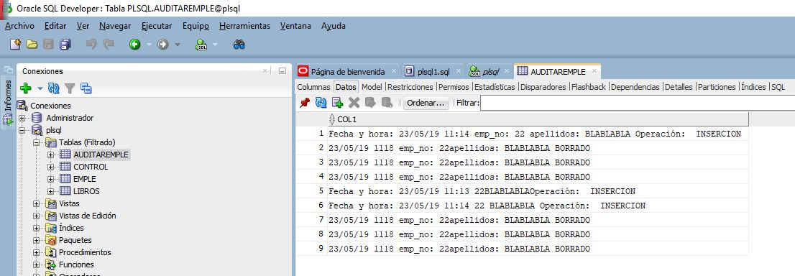

# Relacion 5 de ejercicio de PL/SQL Disparadores

## Tablas

```sql

CREATE TABLE auditarEmple (
    col1 VARCHAR2(200)
);

CREATE TABLE EMPLE(
    emp_no NUMBER(2),
    nombre VARCHAR2(30),
    apellidos VARCHAR2(30)
);

INSERT INTO EMPLE VALUES(11,'PEPITO','CARMONA');
INSERT INTO EMPLE VALUES(22,'ANTONIO','LOZANO');
INSERT INTO EMPLE VALUES(11,'MANUEL','ASDF');
--Establecemos el formato de fecha para que muestre "DD/MM/YYYY HH24:MI":

 alter SESSION SET NLS_DATE_FORMAT = 'DD/MM/YYYY HH24:MI';
```

## Ejercicio

1. Escribe un disparador de bases de datos que permita auditar las operaciones
de inserción o borrado de datos que se realicen en la tabla EMPLE según las siguientes especificaciones:

    - Crear la tabla auditaremple con la columna col1 VARCHAR2(200).
    ```SQL
    CREATE TABLE auditarEmple (
        col1 VARCHAR2(200)
    );
    ```
    - Disparador:
    ```sql
        CREATE OR REPLACE TRIGGER auditar_emple
            BEFORE INSERT OR DELETE
                ON emple
            FOR EACH ROW
        BEGIN
            IF deleting THEN
                INSERT INTO auditarEmple
                    VALUES(TO_CHAR(sysdate,'DD/MM/YY HH24MI ') || 'emp_no: ' || :OLD.emp_no || 'apellidos: ' || :OLD.apellidos || ' BORRADO ');
            ELSIF inserting THEN
                INSERT INTO auditarEmple
                    VALUES('Fecha y hora: ' || TO_CHAR(sysdate,'DD/MM/YY HH24:MI ') || 'emp_no: ' || :NEW.emp_no || ' ' || 'apellidos: '  || :NEW.apellidos || ' '  || 'Operación: ' || ' INSERCION ');
        END IF;
        END;
    ```
- Resultado del disparador al borrar o insertar filas:

> Antes de nada se crea una tabla con los datos que va almacenar el trigger cuando se ejecute.

> Primero se empieza la sentencia PL/SQL con al creación del trigger al cual se le asigna el nombre **auditar_emple** y que antes de que se inserte o se borre algo de la tabla emple realice lo que está dentro del begin.
    >> Dentro del begin nos encontramos con una condicion **IF** que lo que hace es que cuando se borre o se inserte algun dato en la tabla **emple** entonces haga una inserción en la tabla **auditarEmple**:
    >> - Cuando se inserten datos en la tabla **emple** insertará una fila en la tabla **auditarEmple** con los siguientes datos(Fecha y hora en la que se realizó la inserción gracias a la variable **SYSDATE**, el nuevo valor introducido de **emp_no** y **apellidos** gracias a la variable **NEW** que almacena los nuevos registros y la operación que se realiza que es de Inserción).
    >> - Cuando se borren datos en la tabla **emple** se insertará una fila en la tabla **auditarEmple** con los siguiente datos(Fecha y hora en la que se realizó la operación de borrado gracias a la variable **SYSDATE**, los antiguos valores de las filas borradas gracias a la variable **OLD** que almacena los antiguos valores durante la operacion de **DELETE**)

2. Suponiendo que disponemos de la vista:
```sql
CREATE VIEW DEPARTAM AS
    SELECT DEPART.DEPT_NO, DNOMBRE, LOC, COUNT(EMP_NO)
“TOT_EMPLE”
        FROM EMPLE, DEPART
            WHERE EMPLE. DEPT_NO(+) = DEPART.DEPT_NO
                GROUP BY DEPART.DEPT_NO, DNOMBRE, LOC;
```


- Construye un disparador que permita realizar actualizaciones en la tabla DEPART a partir de la vista DEPARTAM.
    - Se comtemplarán las siguientes operaciones:
        - Insertar departamento
        - Borrar departamento
        - Modificar la localidad de un departamento
- Disparador: 
```sql
CREATE OR REPLACE TRIGGER v_departam_depart
    INSTEAD OF DELETE OR INSERT OR UPDATE
        ON departam
    FOR EACH ROW
BEGIN
    IF deleting THEN
        DELETE FROM depart WHERE dept_no = :old.dept_no;
    ELSIF inserting THEN
        INSERT INTO depart 
        VALUES(:new.dept_no, :new.nombre, :new.localizacion);
    ELSIF updating('localizacion') THEN
        UPDATE depart SET localizacion = :new.localizaion
        WHERE dept_no = :old.dept_no;
END IF;
END;
```

> La sentencia empieza con el create del trigger de nombre **v_departam_depart** y continua con el INSTEAD se utiliza para poder modificar las vistas y aqui lo he utilizado apra que en vez de borrar, insertar o actualizar en la tabla **departam**
haga las operaciones que están dentro del **BEGIN**:

> El begin comienza con una condicion **IF** que hace lo siguiente:
    >> - Cuando se realize una operación de borrando en la vista entonces realizará un **DELETE** en la tabla **depart** cuando el **dept_no** sea igual que el **dept_no** que se ha borrado en la vista que sabremos gracias a la variable **OLD**
    >> - Cuando se realize una operación de **inserción** en la vista entonces se hará un **INSERT** a la tabla **depart** con los siguientes datos(el nuevo **dept_no** que está en la variable **NEW** que viene de la vista, el nuevo **nombre** y la nueva **localizacion**)
    >> - Por último, está la operacion de actualizacion que lo que hará es que cuando se actualize la localizacion haga un **UPDATE** en la tabla **depart** y que ponga la **localización** igual a la nueva **localización** almacenada en la variable **NEW** cuando el **dept_no** sea igual al antiguo **dept_no** almacenado en la variable **OLD**

